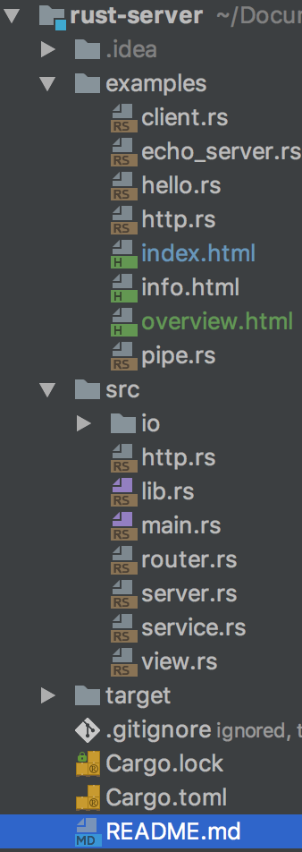

# carbon is a light weight asynchronous web server 

## Idea
At its core, carbon utilize 
[kqueue() system call](https://www.freebsd.org/cgi/man.cgi?query=kqueue&sektion=2) 
from BSD kernel. Kqueue() system call provides a non-blocking channel for user 
to be notified when any of the events in the k-queue happens or holds a condition. 

## Implementation

Architecture overview

```rust
extern crate nix;
extern crate ansi_term;
extern crate regex;
extern crate chrono;
extern crate fnv;

pub mod io; 
pub mod http;
pub mod server;
pub mod service;
pub mod router;
pub mod view;

```



Figure 1 is an overview of the Carbon, the main components are: 
- IO
- Router
- Server
- Service
- View

### IO

`IO` implements two `modulos`: `Event` and `Notification`.

#### Event is a vehicle for kevents 

```rust
use nix::sys::event::{KEvent, EventFilter, FilterFlag};
use nix::sys::event::{EV_ADD, EV_ENABLE, EV_DELETE, EV_ERROR};
use std::os::unix::io::RawFd;

use io::notification::Identifier;
pub struct Event {
	pub kevent: KEvent,
}
impl Event {
	pub fn new(id: &Identifier) -> Event {} 
	pub fn new_from_kevent(kevent: KEvent) -> Event {}
	pub fn get_data(&self) -> u32 {}
	pub fn is_readable(&self) -> bool {}		
	pub fn is_writable(&self) -> bool {}
	pub fn is_error(&self) -> bool {}
	pub fn is_hup(&self)  {}
	pub fn ev_set_add(&mut self) {}
	pub fn ev_set_write(&mut self) {}
	pub fn ev_set_delete(&mut self) {}
	fn new_kevent(id: & RawFd) -> KEvent {}
	pub fn new_timer_event(id: usize, timer: isize) -> Event {}
}

```

#### Notification provide an `EventLoop` and `Handler` to produce `Events` and perform Asynchronous request/response

```rust
pub trait Handler {
    fn ready(&mut self, id:RawFd, ev_set : EventSet, event_loop : &mut EventLoop);
}
pub struct EventLoop {
	kqueue: RawFd,
	// ev_list is used for retrival
	ev_list: Vec<KEvent>,
}
impl EventLoop {
	pub fn new() -> io::Result<EventLoop> {}
	fn ev_register(&self, event: Event) {}
	pub fn register(&self, id: &Identifier) {}
	pub fn reregister() {}
	pub fn deregister(&self, id: &Identifier) {}
	pub fn run<H: Handler>(&mut self, handler: &mut H) {}
	fn poll<H: Handler>(&mut self, handler: &mut H) {}
}
pub struct Identifier {
	fd: RawFd,
	filter: Interest,
}
impl Identifier {
	pub fn new(fd: RawFd, interest: Interest) -> Identifier{}
	pub fn get_fd(&self) -> RawFd {}
	pub fn readable(&self) -> bool {}
	pub fn writable(&self) -> bool {}
pub enum Interest {
    Read,
    Write,
}
pub struct EventSet(usize, usize);
impl EventSet {
	pub fn new() -> EventSet {}
	pub fn readable() -> EventSet {}
	pub fn writable() -> EventSet {}
	pub fn set_data(&mut self, data :usize) {}
	pub fn get_data(&self) -> usize {}
	pub fn is_readable(&self) -> bool {}
	pub fn is_writable(&self) -> bool {}
}

```
### Server binds connection ports and handles request

```rust
pub struct Server<T: Service> {
  event_loop: EventLoop,
  dispatcher: Dispatcher<T>,
} 

impl<T: Service> Server<T> {
  pub fn new(tcp: TcpListener, service: T) -> Server<T> {
    Server {}
  }
  fn initialize(&mut self) {}
  pub fn run(&mut self) {}
}
pub struct Dispatcher<T: Service> {
  id: RawFd,
  listener: TcpListener,
  // callbacks?
  connections: FnvHashMap<RawFd, Client>,  // server needs to maintain a list of accepted connections
  service: T,
}

impl<T: Service>  Dispatcher<T> {
  pub fn new(tcp: TcpListener, service: T) -> Dispatcher<T> {}
  pub fn as_raw_fd(&self) -> RawFd {}

  // Accept a new client connection.
  fn accept(&mut self, event_loop: &mut EventLoop) {}
  fn receive(&mut self, id: RawFd, ev_set: EventSet, event_loop: &mut EventLoop) {}
}

impl<T: Service> Handler for Dispatcher<T> {
    fn ready(&mut self, id: RawFd, ev_set: EventSet, event_loop: &mut EventLoop) {}
}
struct Client {
    socket: TcpStream,
    send_queue: Vec<Message>,
}

impl Client {
    pub fn new(sock: TcpStream) -> Client {}
    pub fn peer_addr(&self) -> Option<SocketAddr> {}
    pub fn as_raw_fd(&self) -> RawFd {}
    pub fn get_message(&mut self, len: &u32) -> Message {}
    pub fn send_message(&mut self, message: Message) -> () {}
    pub fn write_message(&mut self) -> () {}

#[derive(Clone, Debug)]
pub struct Message {
  pub buf: Vec<u8>,
}
impl Message {
  pub fn new() -> Message {}

  pub fn length(&self) -> usize {}
  pub fn from_sock(&mut self, sock: &mut TcpStream, len: u32) {}
  pub fn to_str(&self) -> &str {}
  pub fn print(&self) {}
}

impl Write for Message {
   fn write(&mut self, buf: &[u8]) -> io::Result<usize> {}
   fn flush(&mut self) -> io::Result<()> {}
}

```

### Router provides rules for handle request and query resources

```rust
pub struct RouterBuilder {
	regexs: Vec<&'static str>,
	methods: Vec<Method>,
	views: Vec<Box<View>>,
}
impl RouterBuilder {
	pub fn new() -> RouterBuilder {}
	fn rule(self, method: Method, uri: &'static str, view: Box<View>) -> RouterBuilder {}
	pub fn get(self, uri: &'static str, view: Box<View>) -> RouterBuilder {}
	pub fn post(self, uri: &'static str, view: Box<View>) -> RouterBuilder {}
	pub fn build(self) -> Router {}
}

pub struct Router  {
	regexs: RegexSet,
	methods: Vec<Method>,
	views: Vec<Box<View>>,
	cache: FnvHashMap<String, String>,
}
impl Router {
	pub fn response(&mut self, method: Method, path: &str) -> Response {
		}
	}
	fn route(&self, method: Method, path: &str) -> Option<usize> {}
}

```
### Service provides a bootstrap `trait` `Service`

```rust
pub trait Service {}

```

### View loads resources

```rust
pub trait View {
    fn render(&self, cache: &mut FnvHashMap<String, String>) -> Response;
}

pub struct NotFound;
impl View for NotFound {
	fn render(&self, cache: &mut FnvHashMap<String, String>) -> Response {}
}
pub struct Page {
	url: PathBuf,
}
impl Page {
	pub fn new(path: &'static str) -> Page {}
}
impl View for Page {
	fn render(&self, cache: &mut FnvHashMap<String, String>) -> Response {}
}

```

## Performance

MacBook Pro (13-inch, 2016) 2.9 GHz Intel Core i5
benchmarked with [wrk](https://github.com/wg/wrk) on localhost
```
------------------------------------------------------------------
**this work**

Running 5s test @ http://127.0.0.1:1300
  2 threads and 100 connections
  Thread Stats   Avg      Stdev     Max   +/- Stdev
    Latency     1.22ms  164.79us  11.18ms   90.19%
    Req/Sec    41.05k     5.06k   90.13k    98.02%
  412423 requests in 5.10s, 29.50MB read
Requests/sec:  80860.18
Transfer/sec:      5.78MB

------------------------------------------------------------------
**Node.js v6.10.0**                                                         
                                                                  
Running 5s test @ http://127.0.0.1:8000/
  2 threads and 100 connections
  Thread Stats   Avg      Stdev     Max   +/- Stdev
    Latency     5.41ms    1.15ms  37.93ms   93.59%
    Req/Sec     9.34k     0.97k   10.15k    91.00%
  92965 requests in 5.00s, 13.83MB read
Requests/sec:  18583.21
Transfer/sec:      2.76MB
-------------------------------------------------------------------
**Go 1.8.1** 
Running 5s test @ http://127.0.0.1:80
  2 threads and 100 connections
  Thread Stats   Avg      Stdev     Max   +/- Stdev
    Latency     1.29ms    1.55ms  36.17ms   94.34%
    Req/Sec    35.73k     9.74k   63.00k    67.00%
  356359 requests in 5.02s, 55.62MB read
Requests/sec:  70932.78
Transfer/sec:     11.07MB

-------------------------------------------------------------------
**This work (pipelined)** 
Running 5s test @ http://127.0.0.1:1300
  2 threads and 100 connections
  Thread Stats   Avg      Stdev     Max   +/- Stdev
    Latency     0.89ms  442.31us  12.86ms   52.73%
    Req/Sec   724.88k    48.60k  783.08k    69.00%
  7207000 requests in 5.00s, 515.48MB read
Requests/sec: 1440922.77
Transfer/sec:    103.06MB
-------------------------------------------------------------------

```

### Rust as a language

The idea of Rust-lang is to provide safety for system programming.(although its also
a general purpose language). To achieve this the following features are introduced.

#### Ownership

Variable bindings in `Rust` has a special feature `ownership`, which prevents 
unauthorized reuse of variables. 

For example:

```rust
let v = vec![1,2,3];
let v2 = v;
```

In the above case, by binding `v2` with `v`, we have `transfered` the ownership 
of `vec![1,2,3]` to v2. Therefore any subsequent use of `v` would be illegal.

This requires programmer to explicitly decide whether to `borrow`(by using `&`
to reference) a variable or
`consume` one. 

#### Lifetime

The concept of `Lifetime` of a variable is introduced to avoid problems such as
`dangling pointer`. 

Consider the syntax:

```rust
fn rule(self, method: Method, uri: &'static str, view: Box<View>) -> RouterBuilder {
	match self {
		RouterBuilder {regexs: mut r, methods: mut m, views: mut v} => {
			r.push(uri);
			m.push(method);
			v.push(view);

			RouterBuilder {
				regexs: r,
				methods: m,
				views: v,
			}
		}
	}
}
```

Here the `&'static str` specifies that the str should have `'static` lifetime, which
will survive throughout the program.

```rust
fn skip_prefix<a', 'b>(line: &a' str, prefix: &b' str) -> &a' str {
}
```

Another case of lifetime usage, where a function takes variables with different lifetime. 


## Limitations

* Exceptional speed in crude status of a server is only a start
* `kqueue` is not portable
* Support for databases needs to be implemented

### Linux support to be implemented

## Resources

Benchmark 
Nodejs: https://howtonode.org/hello-node
Go: https://github.com/geetarista/go-http-hello-world/blob/master/hello_world/hello_world.go
